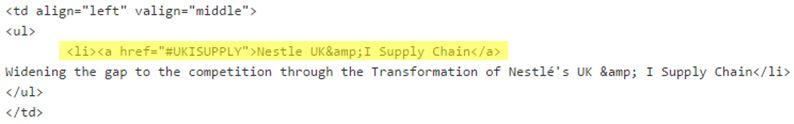

Emily-Leung-Personal-Project
============================

Since my client SkyTouch had my group create a wordpress for them I decided to create a wordpress for my Company. At the moment the existing website for ON THE MARK is very outdated (view it here at http://www.on-the-mark.com/) so I decided I would try and recreate something a bit more modern that they could use (view my WordPress at http://ecleungcis440.wordpress.com/). While I didn't have to create new content, I did have to mimick the layout, functionality and feel of the brand. 

ON THE MARK (OTM) uses a black, red, and orange (as well as varying other shades of these 3 colors) and has a simplistic layout on all of its letterhead and forms. This is why I chose the oxygen theme, it's clean, simple and efficient. Red was chosen for link colors, over the default blue, to play up the OTM colors.

MENU
============================
I also wanted to create a menu bar very similar to the website's current one. This required some research since OTM has so many pages that aren't actually on the default menu bar of 5 links. By this I mean, some pages are internal (you can only find it within the text of a page) and some are drop down links from the 5 main categories. If I didn't modify the menu all of the pages I created would show up on the main menu with no heirarchy.

Here is how the menu turned out.

![menu4] (menu4.jpg)

To do this, I went to edit the menu 

As shown in the picture above. On the left hand side pages that you want to show on the menu can be added and the below picture shows how you can create a heirarchy of tabs in you menu.

In order to use this menu, I needed to check the box 'primary menu' to ensure that this menu would be used rather than the default that is created by WordPress as pages are created.

ANCHORS
============================
I also found some anchors within a page of the OTM website and decided to recreate it. This is found on the Case Studies page under the Results tab. 

To do this I added anchor tags to the code. Here, in yellow, is an example of one tag.

The below is how the code looks when rendered online.

Here is the link that will take the user to the anchor when they click it.

The below is how the code looks when rendered online.

Through this personal assignment I learned how to create a WordPress blog from start to finish, minimize the look and feel of a blog so that it is more of a website, create a menu for a website with many pages and create anchors.
